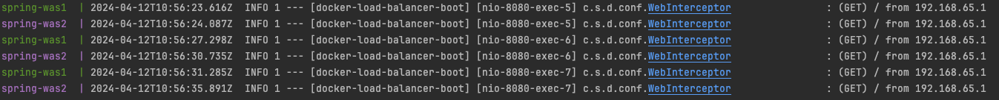

# docker-compose를 이용하여 spring boot Load balancer 컨테이너 배포

```
도커 컴포즈를 활용하여 apache(load balancer)와 spring boot application를 배포를 해보자 
```

## 프로젝트 구조
프로젝트 구조는 다음과 같다.

loadbalancer -> 로드밸러서(apache2 ubuntu)  
app -> spring boot 

/app (spring boot)  
/app/Dockerfile   
/loadbalance  
/loadbalance/000-default.conf  
/loadbalance/Dockerfile  
/loadbalance/entrypoint.sh  
/docker-compose.yml


### /app/Dockerfile
```dockerfile
##### Build Stage #####
# 빌드 작업을 위한 JDK 베이스이미지
FROM openjdk:17

# openjdk에 xargs 포함 x
RUN microdnf install findutils

## 워킹 디렉토리 설정
WORKDIR /workspace/app

# gradlew 복사
COPY gradlew .
# gradle 복사
COPY gradle gradle
# build.gradle 복사
COPY build.gradle .
# settings.gradle 복사
COPY settings.gradle .
# 웹어플리케이션 소스 복사
COPY src src

# gradlew 실행 권한 부여
RUN chmod +x ./gradlew

# gradlew boot jar build
RUN ./gradlew bootJar

# deploy
#ENTRYPOINT ["java", "-Dspring.profiles.active=${PROFILE}", "-jar", "/app/app.jar"]
ENTRYPOINT ["java", "-Dspring.profiles.active=local", "-jar", "/workspace/app/build/libs/docker-load-balancer-boot-0.0.1-SNAPSHOT.jar"]
EXPOSE 8080
```

### /loadbalance/Dockerfile
```dockerfile
FROM ubuntu:18.04

RUN apt -y update
RUN apt install -y apache2
RUN apt install -y apache2-dev
RUN apt install -y wget
RUN apt install -y perl
RUN apt install -y make &&  mkdir /worker

# apache2 module enable
RUN a2enmod ssl
RUN a2enmod proxy
RUN a2enmod proxy_balancer
RUN a2enmod proxy_http
RUN a2enmod lbmethod_byrequests

WORKDIR /

RUN mkdir /log

# apache proxy 설정 파일
RUN rm -rf /etc/apache2/sites-available/000-default.conf
COPY ./loadbalance/000-default.conf /etc/apache2/sites-available/
RUN chmod 755 /etc/apache2/sites-available/000-default.conf

# apache service start
COPY ./loadbalance/entrypoint.sh /
RUN chmod 755 /entrypoint.sh
ENTRYPOINT ["./entrypoint.sh"]
```

### /loadbalance/000-default.conf
```lombok.config
<VirtualHost *:80>
        <Proxy "balancer://mycluster">
                BalancerMember http://host.docker.internal:8081
                BalancerMember http://host.docker.internal:8082
        </Proxy>
        ProxyPass        "/" "balancer://mycluster/"
        ProxyPassReverse "/" "balancer://mycluster/"

        ErrorLog /log/error.log
        CustomLog /log/access.log combined
</VirtualHost>
```

### /loadbalance/entrypoint.sh
```shell
#!/bin/bash

sleep 1
service apache2 start
sleep 1

/bin/bash
```

### /docker-compose.yml
```
version: "3"
services:
  apache:
    hostname: apache-web
    container_name: apache-web
    build:
      context: .
      dockerfile: ./loadbalance/Dockerfile
    stdin_open: true
    tty: true
    ports:
      - 8080:80

  was1: # was1
    build:
      context: ./app # Dockerfile 위치
      dockerfile: Dockerfile # Docker 파일 이름
    container_name: spring-was1 # 컨테이너 이름
    ports: # docker 포트포워딩
      - 8081:8080

  was2: # was1
    build:
      context: ./app # Dockerfile 위치
      dockerfile: Dockerfile # Docker 파일 이름
    container_name: spring-was2 # 컨테이너 이름
    ports: # docker 포트포워딩
      - 8082:8080
```


## 테스트

project 경로에서  
``` shell
$ docker compose up  
```
명령어로 이미지 생성 및 컨테이너 실행 


### was1 접속 (http://localhost:8081)


### was2 접속 (http://localhost:8082)


### apache(load balancer) 접속 (http://localhost:8080)


## localhost:8080 새로고침 반복 후 로그 확인

(로그 확인을 위해 interceptor 사용)

## apache container access 로그 (/log/access.log)


was 1번과 2번에 잘 분산되어 요청되는게 보인다.  


### 느낀점
요즘은 apache 보단 nginx를 사용하여 apache사용법을 많이 까먹었는데 복습하는 느낌이 들어 재미있었다.  
그리고 apache는 centOS에서만 사용해보았는데 redHat 계열과 데비안 계열 사용법(proxy, http module enable 하는법)이   
다른 점이 있어 조금 당황하였다.  

다음엔 docker compose에 데이터 베이스를 추가하여 연동를 포스팅 해보자


